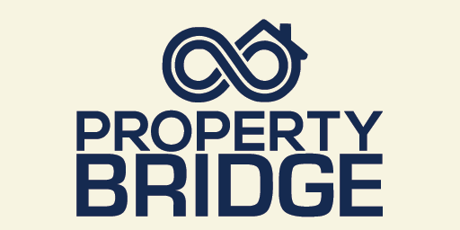

<p align="center">
  
</p>

<h1 align="center">Property Bridge</h1>

<p align="center">
  <strong>Manage all your rental Home Assistant instances from one place.</strong>
</p>

<p align="center">
  
  
  
  
</p>

<p align="center">
  
</p>

One central portal for every property. View and control smart devices, run automations, and monitor connection health across your entire portfolio — built for Airbnb hosts, vacation rental managers, and multi-home owners.

---

## Features

| | |
|:---|:---|
| **Multi-property hub** | Add any number of remote Home Assistant instances via a clean UI config flow |
| **Secure remote access** | Long-lived access tokens — works over Tailscale, WireGuard, Nabu Casa, and DuckDNS |
| **Smart host detection** | Nabu Casa (`.ui.nabu.casa`) and DuckDNS (`.duckdns.org`) automatically use HTTPS on port 443 |
| **Live entity mirroring** | Remote states appear on the central instance and stay in sync over WebSocket |
| **Service-call forwarding** | Control lights, switches, covers, automations, and more on the remote from the central HA |
| **Automation control** | List, trigger, fetch, and update automation configs on the remote instance |
| **Areas & labels** | Automatic Area and Label creation per property |
| **Rental presets** | Check-in / check-out script and scene services for guest turnover |
| **Maintenance windows** | Time-boxed access with optional consent gate (multi-tenant ready) |
| **Health sensors** | Connection status, mirrored entity count, last seen, maintenance state |

---

## Installation

### HACS (recommended)

1. Install [HACS](https://hacs.xyz/) if you don’t already have it.
2. Go to **HACS → Integrations → ⋮ → Custom repositories**.
3. Add:

   ```text
   https://github.com/saboaua/Property-Bridge
   ```

   Category: **Integration**
4. Click **Download**, then **restart Home Assistant**.
5. Go to **Settings → Devices & Services → Add Integration** and search for **Property Bridge**.

### Manual

Copy `custom_components/property_bridge` into your Home Assistant `custom_components` directory and restart.

---

## Configuration

1. On each **remote** Home Assistant, create a **Long-Lived Access Token**  
   (*Profile → Security → Long-Lived Access Tokens*).
2. On the **central** Home Assistant, add the **Property Bridge** integration.
3. Fill in:

   | Field | Example / notes |
   |-------|-----------------|
   | **Property name** | `Aruba Ocean View` |
   | **Host** | Local IP, Tailscale name, `xxxx.ui.nabu.casa`, or `myhouse.duckdns.org` (full URLs accepted) |
   | **Port** | `8123` for local/Tailscale; cloud hosts auto-switch to **443** |
   | **Access token** | Long-lived token from the *remote* instance |
   | **Prefixes** | Optional entity / friendly-name prefixes |
   | **Area / Label** | Toggle automatic creation |

### Options (per property)

After adding a property, open **Configure** on the integration entry:

| Option | Purpose |
|--------|---------|
| Create Area / Label | Auto-create Area and Label named after the property |
| Check-in script / scene | Entity IDs used by `apply_checkin_preset` |
| Check-out script / scene | Entity IDs used by `apply_checkout_preset` |
| Maintenance enabled | Enable maintenance-window feature |
| Require consent | Block opening a window until consent is granted |
| Default window hours | Duration when requesting a maintenance window |

---

## Services

All services need the property **entry_id** (device page or **Settings → Devices & Services → Property Bridge**).

### Rental & maintenance

| Service | Description |
|---------|-------------|
| `property_bridge.apply_checkin_preset` | Run check-in script and/or scene |
| `property_bridge.apply_checkout_preset` | Run check-out script and/or scene |
| `property_bridge.grant_maintenance_consent` | Grant maintenance consent |
| `property_bridge.request_maintenance_window` | Open a time-limited maintenance window |
| `property_bridge.end_maintenance_window` | Close window and revoke consent |

### Remote control & automations

| Service | Description |
|---------|-------------|
| `property_bridge.call_remote_service` | Call any service on the remote HA |
| `property_bridge.trigger_automation` | Trigger a mirrored remote automation |
| `property_bridge.list_automations` | List mirrored automations (response data) |
| `property_bridge.get_automation_config` | Fetch full automation config from remote |
| `property_bridge.update_automation_config` | Create/update automation config on remote |

### Controlling mirrored devices

When connected, service calls on the **central** HA that target a mirrored entity (light, switch, automation, cover, …) are **automatically forwarded** to the remote instance.

```yaml
# Trigger a remote automation
service: property_bridge.trigger_automation
data:
  entry_id: YOUR_ENTRY_ID
  entity_id: automation.guest_arrival

# Get full config (use automation unique id from attributes → id)
service: property_bridge.get_automation_config
data:
  entry_id: YOUR_ENTRY_ID
  automation_id: guest_arrival

# Push an updated config to the remote
service: property_bridge.update_automation_config
data:
  entry_id: YOUR_ENTRY_ID
  automation_id: guest_arrival
  config:
    alias: Guest arrival
    trigger:
      - platform: state
        entity_id: binary_sensor.front_door
        to: "on"
    action:
      - service: light.turn_on
        target:
          entity_id: light.entry
```

> **Note:** Home Assistant’s built-in automation editor only edits *local* automations. For remote ones, use the services above, or enable/disable/trigger mirrored automation entities on the central instance.

### Example: calendar check-in

```yaml
automation:
  - alias: "Property check-in preset"
    trigger:
      - platform: calendar
        event: start
        entity_id: calendar.airbnb_aruba_ocean_view
    action:
      - service: property_bridge.apply_checkin_preset
        data:
          entry_id: "YOUR_CONFIG_ENTRY_ID"
```

---

## Sensors (per property)

| Entity | Description |
|--------|-------------|
| **Connection Status** | Connected / Disconnected |
| **Mirrored Entities** | Count of remote entities currently mirrored |
| **Maintenance Until** | When the current maintenance window ends |
| **Maintenance Allowed** | On while a valid window is open |
| **Maintenance Consent** | On when consent has been granted |

Connection Status also exposes attributes such as `ws_url`, `last_error`, `host`, `port`, and `remote_version` for troubleshooting.

---

## Recommended network setup

- Install [Tailscale](https://tailscale.com/) (or Headscale) on every Home Assistant instance.
- Use the Tailscale hostname as `host` — works behind CGNAT with no open ports.
- Apply ACLs so only the central management instance (and authorized users) can reach property instances.
- Nabu Casa and DuckDNS remote access are supported out of the box.

---

## Roadmap

- [x] HACS-compatible structure & config flow
- [x] Connection status sensors
- [x] Automatic area / label assignment per property
- [x] Rental calendar helpers (check-in / check-out presets)
- [x] Maintenance windows / consent
- [x] Live WebSocket entity mirroring
- [x] Service-call forwarding to remote
- [x] Automation list / trigger / get / update config
- [ ] Include / exclude domain & entity filters in options UI
- [ ] Bulk health dashboard card
- [ ] Deeper calendar integration (auto entry_id lookup)

---

## Development

```bash
git clone https://github.com/saboaua/Property-Bridge.git
```

```text
custom_components/property_bridge/
├── __init__.py
├── config_flow.py
├── connection.py
├── const.py
├── helpers.py
├── manifest.json
├── sensor.py
├── binary_sensor.py
├── services.py
├── services.yaml
├── strings.json
└── translations/
```

---

## Credits

Inspired by the community component [remote_homeassistant](https://github.com/custom-components/remote_homeassistant).  
Built for people managing smart vacation rentals and multi-property portfolios with Home Assistant.

---

## License

[MIT](LICENSE) — free to use, modify, and distribute.
