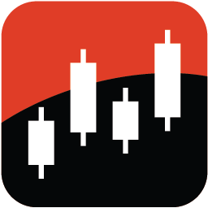

<p align="center">
  
</p>

<h1 align="center">Portfolio Tracker</h1>

<p align="center">
  <strong>Stock, ETF &amp; crypto portfolio tracking for Home Assistant</strong><br>
  UI-managed holdings · Yahoo Finance prices · market hours · Lovelace templates
</p>

<p align="center">
  
  
  
  
</p>

---

## Highlights

| | |
|:--|:--|
| **No YAML for trades** | Add, buy, sell, edit, remove from **Configure** |
| **Yahoo Finance** | Live prices, no API key, no `yfinance` package |
| **Adaptive polling** | 5 min while US/EU markets are open, 30 min when closed (configurable) |
| **Market clocks** | US & EU open/closed sensors with next open/close times |
| **Realized P/L** | Tracked when you sell (with optional proceeds) |
| **Dashboards included** | Ready-made Lovelace cards under `dashboards/` |

---

## What you get

### Per symbol (e.g. `NVDA`, `VUAA.L`, `BTC-USD`)

| Entity | Description |
|--------|-------------|
| `sensor.<symbol>_price` | Live price + name, exchange, day change, 52-week high/low, volume |
| `sensor.<symbol>_position_value` | Market value + shares, invested, gain, **allocation %**, days held |

### Portfolio-wide

| Entity | Description |
|--------|-------------|
| `sensor.portfolio_total_value` | Sum of position values |
| `sensor.portfolio_total_invested` | Cost basis |
| `sensor.portfolio_total_gain` | Unrealized P/L (`gain_pct`) |
| `sensor.portfolio_day_change` | Day P/L (`gain_pct`) |
| `sensor.portfolio_realized_gain` | Realized P/L from sells + recent trade log |
| `sensor.portfolio_holdings_count` | Number of open positions |
| `sensor.portfolio_holdings_table` | `rows` for `custom:flex-table-card` |

### Market hours

| Entity | Description |
|--------|-------------|
| `binary_sensor.us_market_open` / `eu_market_open` | Session on/off |
| `sensor.us_market_session` / `eu_market_session` | `open` / `closed` + open/close times |

### Services

```yaml
service: portfolio_tracker.buy_shares
data:
  symbol: NVDA
  shares: 2
  cost: 350.00

service: portfolio_tracker.sell_shares
data:
  symbol: NVDA
  shares: 2
  proceeds: 440.00   # optional — records realized P/L
```

---

## Install via HACS (custom repository)

1. **HACS → Integrations → ⋮ → Custom repositories**
2. URL = your GitHub repo · Category = **Integration**
3. Download **Portfolio Tracker** → **Restart Home Assistant**
4. **Settings → Devices & Services → Add Integration → Portfolio Tracker**

### Version updates

HACS compares `manifest.json` → `version`. Publish a GitHub Release (e.g. `v1.3.0`) when you ship. After updating, **restart HA**.

### Icon note (HACS list)

Home Assistant shows the integration icon under **Devices & Services** via `brand/icon.png`.  
The HACS *Downloaded* list may still show **“Icon not available”** for **custom** repositories — that is a [known HACS limitation](https://github.com/hacs/integration/issues/5171) (it looks up brands CDN, not your repo). The icon still appears correctly in HA itself.

---

## Lovelace cards — required frontend components

To match the designed Portfolio dashboard, install these from **HACS → Frontend**:

| Component | Used for |
|-----------|----------|
| **button-card** | Market pills, overview hero, stock tiles |
| **auto-entities** | Dynamic per-stock tiles when you add/remove holdings |
| **flex-table-card** | Holdings table |
| **card-mod** | Spacing, borders, theme polish |
| **layout-card** | Responsive market-hours grid (optional if using simple stack) |
| **vertical-stack-in-card** | Grouped card chrome (optional) |
| **Mushroom** | Section titles (`mushroom-title-card`) |
| **mini-graph-card** | Sparkline next to total value (optional) |

Paste YAML from the `dashboards/` folder into a view (see `market_hours_stacked_resizable.yaml`, `portfolio_overview_dynamic.yaml`, `holdings_table.yaml`, `manage_portfolio_launcher.yaml`).

---

## Manage holdings

**Settings → Devices & Services → Portfolio Tracker → Configure**

- Add a new stock  
- Buy more shares  
- Sell shares (enter **proceeds** to record realized gain)  
- Edit shares / cost basis  
- Remove a stock  
- **Update intervals** (open vs closed market polling)

---

## Tips

- London listings: use Yahoo suffixes (`VUAA.L`).
- Crypto via Yahoo: `BTC-USD`, `ETH-USD`, etc.
- Diagnostics: device page → **Download diagnostics**.
- Entity IDs on older installs may be prefixed `portfolio_tracker_` — dashboards should match your **Developer Tools → States** IDs.

---

## Uninstall

Delete the integration under Devices & Services, then remove it from HACS.
